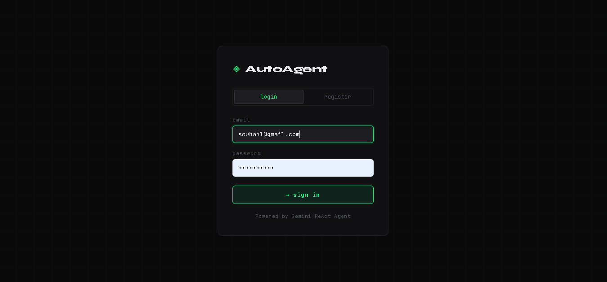
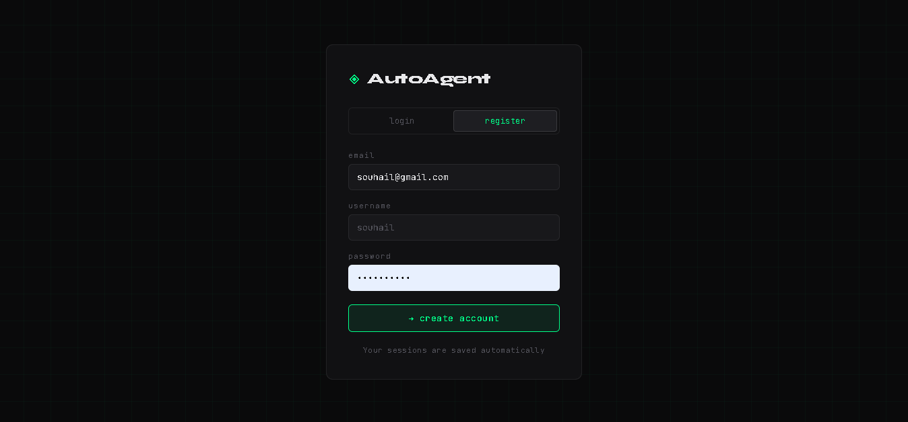
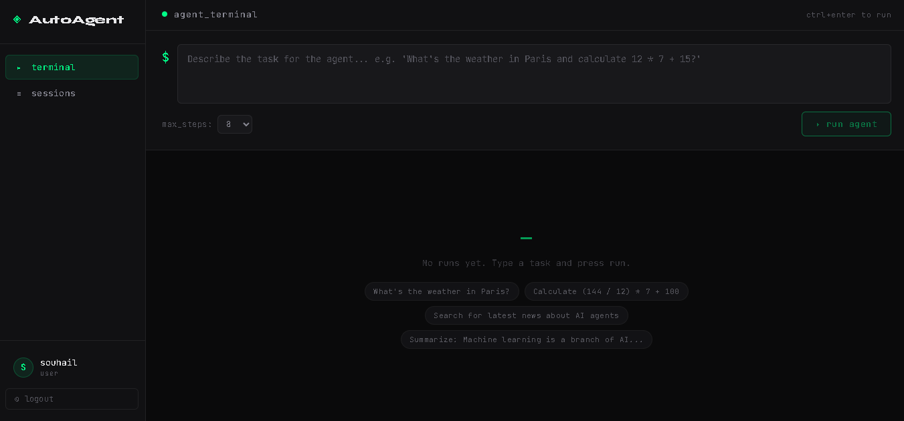
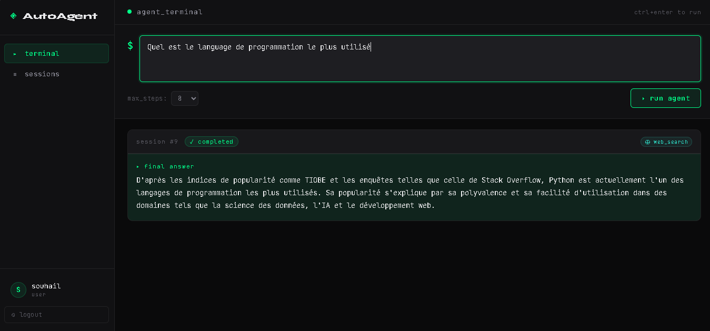
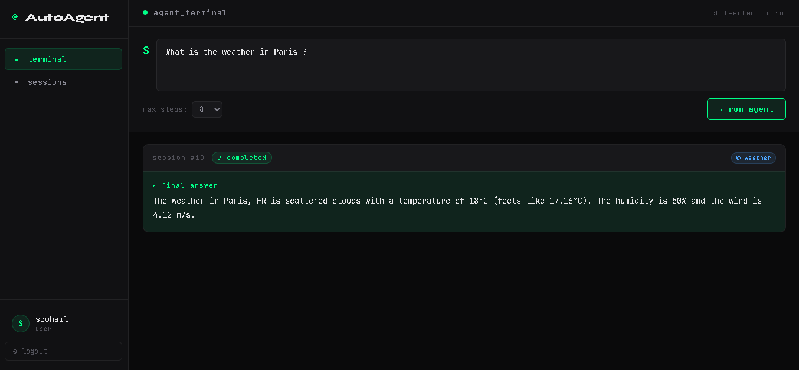
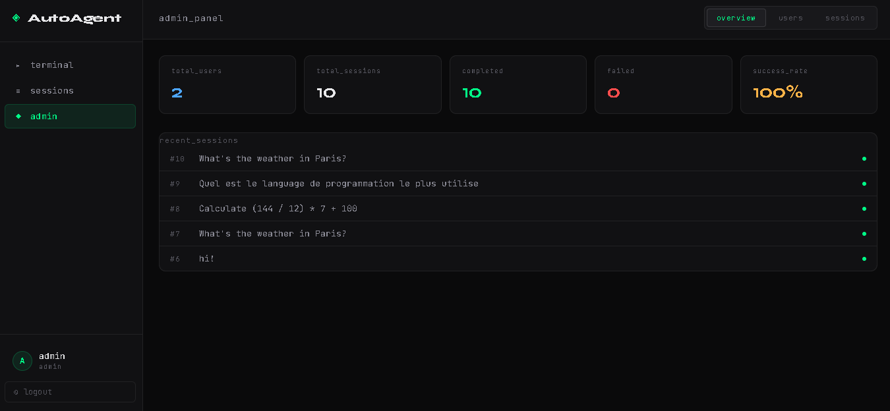
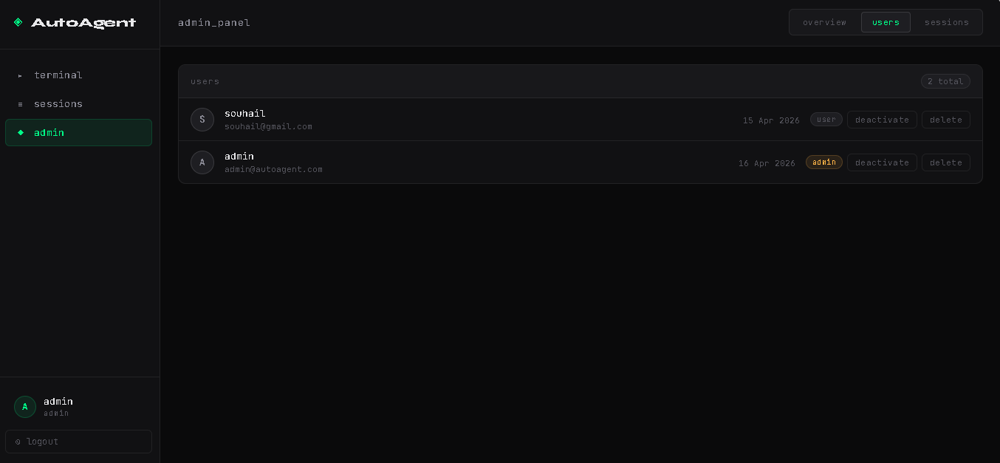
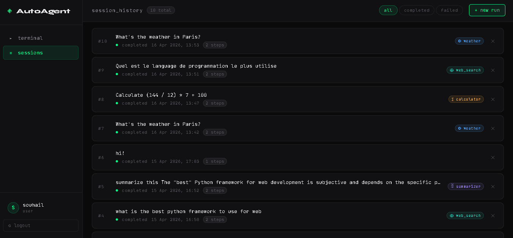

# AutoAgent-API

AutoAgent-API is an autonomous AI agent platform based on the **ReAct (Reasoning + Acting)** pattern.  
It leverages **Gemini 2.5 Flash** to break down complex tasks into logical steps, use tools in real time, and return structured final answers.

---
## 📸 Screenshots

### 🔐 Authentication

#### Login


#### Register


---

### 🤖 ReAct Agent

#### Terminal (ReAct Loop)


#### Questions




---

### 📊 Dashboard & History

#### Admin Dashboard

### Admin : Manage Users


#### User Session History


---
## 🚀 Features

### 🧠 ReAct Engine (Reasoning + Acting)

An intelligent reasoning loop:
- **Thought** → reasoning step  
- **Action** → selects a tool  
- **Observation** → analyzes result  
- **Iteration** → repeats until final answer  

---

### 🛠️ Integrated Toolset

- **Calculator** → Accurate mathematical computations  
- **Weather** → Real-time weather data  
- **Web Search** → Up-to-date information retrieval  
- **Summarizer** → Condense long texts
- **Default** → The agent’s standard reasoning behavior

---

### 🔐 Authentication

- JWT (**Access + Refresh tokens**)  
- Role-based access:
  - User  
  - Admin  

---

### 📊 Persistence & History

- Session storage  
- Full reasoning trace (ReAct steps)  
- Tool usage tracking  

---

## 🛠️ Tech Stack

### Backend

- FastAPI  
- Pydantic (v2)  
- SQLAlchemy  
- SQLite  
- Google Generative AI (Gemini)  
- python-jose  

### Frontend

- React 18  
- CSS Modules  
- Axios  

---

## 🛣️ API Endpoints

### Authentication

| Method | Endpoint | Description |
|--------|---------|------------|
| POST | /auth/register | Create a new account |
| POST | /auth/login | Get JWT tokens |
| POST | /auth/refresh | Refresh access token |
| GET | /auth/me | Get current user profile |

---

### Agent

| Method | Endpoint | Description |
|--------|---------|------------|
| POST | /agent/run | Start a new task (ReAct loop) |
| GET | /agent/sessions | List user sessions |
| GET | /agent/sessions/{id} | Session details |
| DELETE | /agent/sessions/{id} | Delete a session |

---

### Admin

| Method | Endpoint | Description |
|--------|---------|------------|
| GET | /admin/users | List all users |
| GET | /admin/stats | Global statistics |
| PATCH | /admin/users/{id} | Update user |

---

## 🛠️ Installation

### 1️⃣ Backend

```bash
python -m venv venv
source venv/bin/activate  # Windows: venv\Scripts\activate
pip install -r requirements.txt
```

Create a `.env` file:

```env
APP_NAME="AutoAgent API"
GEMINI_API_KEY="your_gemini_api_key"
DATABASE_URL="sqlite:///./autoagent.db"
SECRET_KEY="your_jwt_secret"
```

---

### 2️⃣ Frontend

```bash
cd frontend
npm install
npm run dev
```

---
## 👤 Author

**Souhail HMAHMA** — Full Stack Developer

🌐 [souhail3.vercel.app](https://souhail3.vercel.app) · 💼 [LinkedIn](https://linkedin.com/in/souhail-hmahma) · 🐙 [GitHub](https://github.com/souhmahma)
